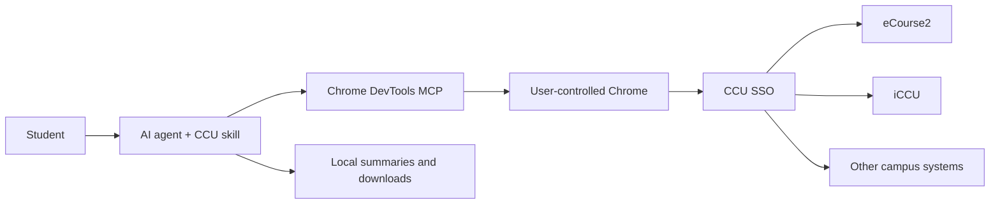

<div align="center">

# CCU Assistant

**A privacy-first academic AI agent for National Chung Cheng University.**

透過 Chrome DevTools MCP 整理 eCourse2、iCCU 與校務系統資料，協助學生查詢課程、
公告、作業、教材、課表與成績。

[](https://github.com/febsi29/ccu/actions/workflows/ci.yml)
[](LICENSE)
[](https://github.com/ChromeDevTools/chrome-devtools-mcp)

</div>

## Why this project

CCU's Moodle web service is disabled and several campus systems sit behind SSO
and Cloudflare. CCU Assistant demonstrates how an AI agent can route requests
to the correct system, operate a user-controlled browser, extract structured
information from the DOM, and produce useful local reports without storing
credentials.

## Capabilities

| Task | Source |
|---|---|
| Courses, announcements, assignments, materials, grades | eCourse2 |
| Weekly schedule and academic records | iCCU |
| Course catalog and syllabi | eCourse2 / iCCU |
| Leave requests and enrollment certificates | CCU student systems |
| Consolidated course dashboard | Locally generated output |

Example prompts:

```text
/ccu 這週有什麼作業？
/ccu 整理課表和近期截止日期
/ccu 下載本學期所有課程教材
/ccu 幫我看 eCourse2 成績
```

## Architecture



The agent chooses a destination from the routing table in `SKILL.md`, reads the
visible page structure, and writes only the output requested by the user.

## Security model

- Sign in manually inside Chrome. **Never paste a CCU password into an AI chat.**
- The launch scripts bind the debugging interface to `127.0.0.1`.
- A dedicated Chrome profile keeps this workflow separate from daily browsing.
- Course data and downloaded materials remain on the local computer.
- Destructive or administrative actions require explicit confirmation.
- `.env`, browser profiles, credentials, and agent-local settings are ignored.

See [SECURITY.md](SECURITY.md) for reporting guidance.

## Requirements

- Node.js 20+
- Google Chrome
- An AI agent that supports skills and MCP servers
- [Chrome DevTools MCP](https://github.com/ChromeDevTools/chrome-devtools-mcp)

## Installation

### 1. Install the skill

Clone the repository into your agent's skill directory.

```bash
# Claude Code
git clone https://github.com/febsi29/ccu.git ~/.claude/skills/ccu

# Codex
git clone https://github.com/febsi29/ccu.git ~/.codex/skills/ccu
```

For another agent, clone the repository into that product's documented skills
directory.

### 2. Configure Chrome DevTools MCP

Add the following server to your agent's MCP configuration:

```json
{
  "mcpServers": {
    "chrome-devtools": {
      "command": "npx",
      "args": [
        "chrome-devtools-mcp@latest",
        "--browserUrl=http://127.0.0.1:9222"
      ]
    }
  }
}
```

### 3. Launch the dedicated Chrome profile

- Windows: double-click `start-chrome.bat`
- macOS or Linux: run `./start-chrome.sh`

Sign in to eCourse2 manually in the opened Chrome window. Then invoke `/ccu`
from your AI agent.

## How it works

1. The agent verifies the Chrome connection.
2. If CCU SSO requires authentication, the agent pauses for manual login.
3. The request is routed to eCourse2, iCCU, or another campus system.
4. Visible DOM content is parsed into structured local data.
5. Existing output files are updated incrementally without overwriting edits.

Detailed selectors, routing notes, and output conventions live under
[`references/`](references/).

## Limitations

- CCU page structure can change without notice and may require selector updates.
- Some iCCU services require the campus network or VPN.
- Multi-course synchronization browses pages sequentially and may take several
  minutes.
- The skill does not bypass CAPTCHA, Cloudflare challenges, or access controls.
- Users remain responsible for complying with university policies.

## Development

```bash
python scripts/validate_skill.py
python -m unittest discover -s tests
python -m ruff format --check .
python -m ruff check .
python -m mypy scripts tests
shellcheck start-chrome.sh
```

## Repository structure

```text
.
├── SKILL.md
├── references/
├── scripts/validate_skill.py
├── tests/test_validate_skill.py
├── start-chrome.bat
├── start-chrome.sh
└── README.md
```

## Acknowledgements

The structure was inspired by
[YouMingYeh/ntu](https://github.com/YouMingYeh/ntu), an academic assistant for
National Taiwan University.

## License

Released under the [MIT License](LICENSE).
